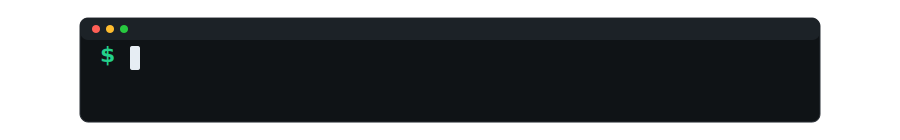

      

---

### *Tout ce qui est imaginable en numérique, je le rends réel.* 

*De l'idée à la réalisation : **TOUT est possible** !*

 

### **Technologies Maîtrisées - Stack Complète**

---

      

## ⭐ Créer votre boutique en ligne
- **Site de vente** — pour vendre vos produits 24h/24
- **Catalogue produits** — photos, descriptions, prix automatiques
- **Paiement sécurisé** — carte bancaire, PayPal, virement
- **Gestion automatique** — stocks, commandes, factures

## ⭐ Être visible sur internet
- **Site professionnel** — qui donne confiance à vos clients
- **Être trouvé sur Google** — apparaître quand on vous cherche
- **Mesurer vos résultats** — savoir ce qui marche vraiment

## ⭐ Simplifier votre gestion quotidienne
- **Fichier clients intelligent** — historique, préférences, relances
- **Facturation automatique** — devis, factures, rappels de paiement
- **Planning équipe** — congés, horaires, tâches du jour
- **Tableaux de bord** — voir vos ventes, vos performances d'un coup d'œil

 

      

## ⭐ Jeux et communautés
- **Serveurs Minecraft** — mondes personnalisés pour votre communauté
- **Serveurs FiveM** — votre serveur GTA roleplay unique
- **Bots Discord** — modération et fonctions sur-mesure
- **Hébergement gaming** — serveurs rapides et sécurisés

## ⭐ Applications sur-mesure
- **Sites internet** — vitrine, blog, boutique, sur-mesure
- **Apps mobile** — iPhone et Android pour vos clients
- **Logiciels Windows/Mac** — outils spécifiques à votre activité
- **Espaces privés** — zones réservées clients, gestion interne

 

      

## ⭐ Créer rapidement
- **Analyser vos besoins** — comprendre ce qui vous faut
- **Version test** — pour valider votre idée
- **Auditer l'existant** — voir ce qui peut être amélioré
- **Solutions prêtes à l'emploi** — configurations standards adaptées
- **Former vos équipes** — utiliser au mieux vos nouveaux outils
- **Mise en ligne express** — opérationnel en quelques semaines

## ⭐ Améliorer et maintenir
- **Moderniser votre site** — plus rapide, plus beau, plus efficace
- **Ajouter des fonctions** — nouvelles possibilités selon vos besoins
- **Réparer et améliorer** — corriger les bugs, optimiser les performances
- **Support continu** — je reste disponible après la livraison

 

      

1. **On se parle** — vous m'expliquez vos besoins, vos objectifs
2. **Je vous propose** — solutions adaptées avec prix transparent
3. **Je développe** — création étape par étape, vous validez
4. **On teste ensemble** — vérification que tout fonctionne parfaitement
5. **Je vous forme** — vous apprenez à utiliser vos nouveaux outils
6. **Je vous accompagne** — support et améliorations si besoin

 

*Développement légal et conforme • Code source fourni • Garantie qualité*

---

##  *Contact & Réseaux* 

### *Collaborons ensemble sur vos projets les plus ambitieux*

**© 2025***

